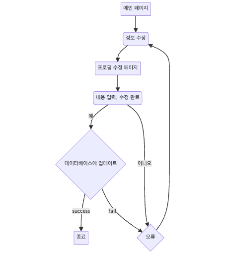

# 기능 정의

## 출결 관리 사용자 스토리

수강생으로서, 인트라넷을 통해 입실/퇴실 버튼 클릭만으로 출결기록을 전송하고, 

외출/조퇴, 휴가, 공가 신청을 할 수 있습니다.

관리자로서, 수강생의 출결, 휴가, 공가, 외출/조퇴  문의를 처리 할 수 있습니다.

수강생으로서, 각 신청 섹션에 관리자가 등록한 파일을  다운로드 받을 수 있고 인트라넷 내의 pdf변환, zip압축 기능을 통해 더 간편하게 서류를 제출할 수 있습니다.

## 게시판 사용자 스토리

부트캠프 관리자로서, 공지사항을 등록하여 수강생들에게 최신의 이슈와 자료, 그리고 수강생들이 요청한 행정 문서를 공유할 수 있습니다.

부트캠프 수강생으로서, 나는 과정에 관련된 문의를 하고싶을 때 글을 작성할 수 있습니다. 그래서 궁금한 정보를 얻을 수 있습니다. 

부트캠프 수강생으로서, 내가 필요한 행정 서류(출석부, 수강증명서, 참여확인서 등) 를 요청할 수 있습니다. 그래서 원활하고 빠르게 요청한 서류를 받을 수 있습니다.

## 수강생 관리 사용자 스토리

부트캠프 매니저로서, 수강생의 리스트에서 프로필을 확인하고 불필요한 수강생의 정보를 삭제할 수 있습니다. 그래서 수강생 데이터베이스를 최신 상태로 유지할 수 있습니다. 

## 사용자 프로필 스토리

부트캠프 수강생으로서, 나는 나의 정보(사진,블로그주소, 깃허브주소 등)를 수정하고 싶습니다. 그래서 잘못된 정보를 정정하거나 최신 정보를 유지할 수 있습니다.

## 메신저 사용자 스토리

페스트넷 사용자로서 개인적인 용무를 개개인과 소통할 수 있습니다.
